# FIAP - Faculdade de Informática e Administração Paulista

<p align="center">
<a href= "https://www.fiap.com.br/"></a>
</p>

<br>


# Projeto: fiap_fase3_cap1-novo

## Atividade em Grupo: FIAP - 1TIAOB - 2025/1 - Fase3 Cap1

## 👨‍🎓 Integrantes: 
- <a href="">Alice C. M. Assis - RM 566233</a>
- <a href="">Leonardo S. Souza - RM 563928</a>
- <a href="">Lucas B. Francelino - RM 561409</a> 
- <a href="">Pedro L. T. Silva - RM 561644</a> 
- <a href="">Vitor A. Bezerra - RM 563001</a>

## 👩‍🏫 Professores:
### Tutor(a) 
- <a href="proflucas.moreira@fiap.com.br">Lucas Gomes Moreira</a>
### Coordenador(a)
- <a href="profandre.chiovato@fiap.com.br">André Godoi Chiovato</a>


## 📜 Descrição

Nesta etapa, a FarmTech Solutions implementa um sistema de irrigação inteligente com sensores de umidade, nutrientes e pH, capazes de acionar automaticamente a bomba de irrigação conforme os dados coletados. As informações são armazenadas em um banco de dados SQL, permitindo visualização e análises estatísticas dos resultados.

## Objetivos do projeto:

- Herança da Fase 3: Realizar um fork do projeto da Fase 3 [https://github.com/Hinten/fiap_fase3_cap1-novo](https://github.com/Hinten/fiap_fase3_cap1-novo) melhorias solicitadas no enunciado;
- Código C/C++ otimizado: Entregar um código revisado e otimizado para o ESP32, gerenciando sensores e exibindo dados no display LCD;
- Banco de dados: Aprimorar o banco de dados, revisando e atualizando o modelo de negócio da FarmTech Solutions;
- Código Python com Scikit-learn e Streamlit: Implementar a modelagem preditiva utilizando Scikit-learn e uma interface interativa com Streamlit;
- Integração do Serial Plotter: Demonstrar o uso do Serial Plotter com prints do Wokwi para monitoramento das variáveis, insira e explicar os prints no README;
- Documentação e atualização no GitHub: Atualizar o repositório com documentação detalhada no README, incluindo explicações das melhorias, imagens e prints;
- Vídeo: Gravar um vídeo de até 5 minutos mostrando o funcionamento do sistema atualizado.

## Automação e inteligência na FarmTech Solutions

**Confira o vídeo de apresentação do projeto clicando no link ou imagem abaixo:**

<div align="center">
  <a href="https://youtu.be/XujLcoHgntE" target="_blank">
    
  </a>
</div>


[https://youtu.be/XujLcoHgntE](https://youtu.be/XujLcoHgntE)

## Entrega 1: Sistema de Sensores e Controle com ESP32

### 1️⃣ Circuito de sensores

O circuito de sensores foi atualizado, com os seguintes componentes:

<p align="center">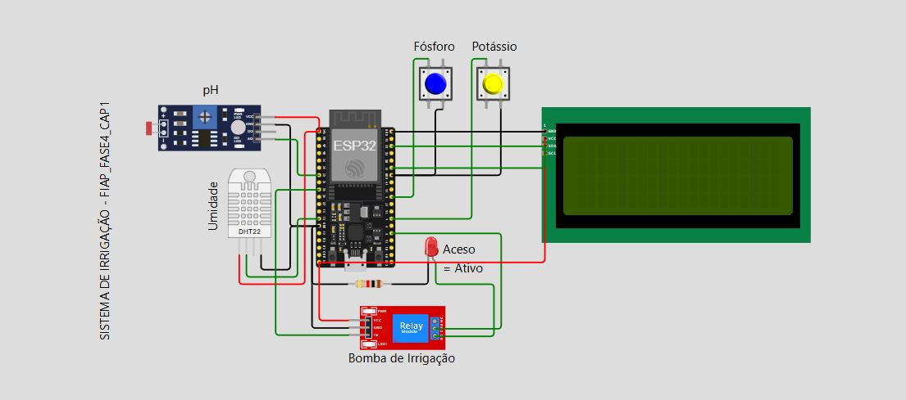</p>

    - link do sistem no Wokwi: https://wokwi.com/projects/433871258996030465

Abaixo estão os componentes utilizados:
- 1x ESP32
- 1x Sensor LDR representando o Sensor de pH
- 1x Sensor de temperatura e umidade DHT22
- 1x Botão representando o Sensor de Fósforo
- 1x Botão representando o Sensor de Potássio
- 1x Relé
- 1x Led representando a bomba d'água
- 1x Display LCD com 4 linhas, 20 caracteres por linha - lcd2004

### Código do ESP32

O código do ESP32 foi atualizado, e pode ser encontrado no arquivo [sketch.cpp](src/wokwi/src/sketch.cpp). 
O código é responsável por monitorar a necessidade de irrigação em uma plantação, simulando sensores de nutrientes e condições ambientais.
A versão anterior pode ser encontrada no arquivo [sketch.ino](src/wokwi/old/sketch.ino). 
Segue abaixo a explicação do código atualizado e melhorias em relação a versão anterior

## Funcionamento

O sistema de irrigação inteligente passou por uma grande evolução na transição do código `sketch.ino` para o novo `sketch.cpp`. Abaixo, destacamos as principais mudanças e melhorias implementadas:

### Principais melhorias do `sketch.cpp` em relação ao `sketch.ino`

- **Estrutura e Organização:**
  - O código foi modularizado, com funções separadas para conexão Wi-Fi, envio de dados à API, atualização do display LCD e registro no Serial Monitor, facilitando manutenção e expansão.
  - Uso de `constexpr` e tipos explícitos para definição de pinos e constantes, aumentando a clareza e segurança.

- **Integração com Rede e API:**
  - O ESP32 conecta-se automaticamente ao Wi-Fi e envia dados dos sensores para uma API remota, que pode decidir sobre a irrigação de forma centralizada e inteligente.
  - O sistema consulta a API para saber se deve irrigar, tornando a decisão mais robusta e baseada em dados externos.

- **Lógica de Decisão Otimizada:**
  - A lógica local de ativação da irrigação foi mantida, mas agora é possível priorizar a resposta da API, tornando o sistema híbrido (local + remoto).
  - O cálculo do pH simulado pelo LDR foi aprimorado: agora o valor é convertido proporcionalmente para a escala real de pH (0 a 14), tornando a simulação mais fiel.
  - A contagem de condições críticas foi simplificada e otimizada, tornando o código mais enxuto e eficiente.

- **Interface e Feedback ao Usuário:**
  - Inclusão de display LCD I2C para exibir, em tempo real, umidade, pH, estado dos nutrientes e status da irrigação.
  - Mensagens mais claras e resumidas no Serial Monitor, facilitando o acompanhamento e debug.

- **Robustez e Manutenção:**
  - Funções auxiliares centralizam a atualização das saídas (LCD e Serial), facilitando futuras manutenções.
  - O tratamento dos botões foi refinado para evitar leituras falsas, com debounce otimizado e variáveis de estado bem definidas.

- **Identificação e Expansão:**
  - O ESP32 envia seu ID único para a API, permitindo rastreabilidade e controle individualizado dos sensores.
  - O código está preparado para integração com novos sensores, atuadores e funcionalidades futuras.

#### Resumo das principais diferenças

| Aspecto                  | Versão Anterior (`sketch.ino`) | Versão Atual (`sketch.cpp`)         |
|--------------------------|---------------------------------|-------------------------------------|
| Organização              | Código monolítico               | Modularizado, funções separadas     |
| Rede/API                 | Não possui                      | Integração Wi-Fi e API remota       |
| Display                  | Não possui                      | LCD I2C com dados em tempo real     |
| Decisão de irrigação     | Apenas local                    | Local + consulta à API              |
| Conversão de pH          | Simples (divisão por 100)       | Proporcional à escala real (0-14)   |
| Robustez                 | Básica                          | Debounce otimizado, logs claros     |
| Expansibilidade          | Limitada                        | Estrutura pronta para expansão      |

Essas melhorias tornam o sistema mais inteligente, confiável, fácil de manter e pronto para integração com soluções de agricultura digital e IoT.

---


### Exemplos de Trechos do Código

- **Definição dos pinos dos sensores e atuadores (agora com constexpr e tipos explícitos):**
  ```cpp
  constexpr uint8_t BUTTON_P      = 5;   // Botão fósforo (GPIO5)
  constexpr uint8_t BUTTON_K      = 4;   // Botão potássio (GPIO4)
  constexpr uint8_t LDR_PIN       = 32;  // Pino LDR (GPIO32)
  constexpr uint8_t DHTPIN        = 12;
  constexpr uint8_t RELAY_PIN     = 25;
  constexpr uint8_t LED_PIN       = 2;
  constexpr uint8_t BUTTON_API    = 18;
  constexpr auto    DHTTYPE       = DHT22;
  ```

- **Leitura dos sensores e botões (com debounce otimizado):**
  ```cpp
  uint8_t leituraAtual = digitalRead(BUTTON_P);
  if(leituraAtual == LOW && ultimoEstadoFosforo == HIGH) {
    estadoFosforo = !estadoFosforo;
    delay(150);  // Debounce reduzido
  }
  ultimoEstadoFosforo = leituraAtual;

  leituraAtual = digitalRead(BUTTON_K);
  if(leituraAtual == LOW && ultimoEstadoPotassio == HIGH) {
    estadoPotassio = !estadoPotassio;
    delay(150);
  }
  ultimoEstadoPotassio = leituraAtual;

  uint16_t ldrValue = analogRead(LDR_PIN);  // 0-4095
  float umidade = dht.readHumidity();
  float phSimulado = (ldrValue / 4095.0f) * 14.0f; // Conversão proporcional pH
  ```

- **Lógica de decisão para acionar a irrigação (local + API):**
  ```cpp
  uint8_t condicoesCriticas = 0;
  condicoesCriticas += !estadoFosforo;
  condicoesCriticas += !estadoPotassio;
  condicoesCriticas += (ldrValue > 700);
  condicoesCriticas += (umidade < 60.0f);

  bool irrigacaoAtiva_local = condicoesCriticas >= 2;

  // Envio dos dados para API e consulta decisão remota
  int resposta_irrigacao = should_irrigate(doc);
  bool irrigacaoAtiva = irrigacaoAtiva_local;
  if (resposta_irrigacao != -1) {
    irrigacaoAtiva = resposta_irrigacao == 1;
  }

  digitalWrite(RELAY_PIN, irrigacaoAtiva);
  digitalWrite(LED_PIN, irrigacaoAtiva);
  ```

- **Atualização do display LCD e log no Serial Monitor:**
  ```cpp
  void atualizarLCD(float& umidade, float& ph, bool& irrigStatus) {
    lcd.clear();
    lcd.setCursor(0, 0);
    lcd.print(F("U:"));
    lcd.print(umidade, 1);
    lcd.print(F("% pH:"));
    lcd.print(ph, 1);
    lcd.setCursor(0, 1);
    lcd.print(F("F:"));
    lcd.print(estadoFosforo ? F("Y") : F("N"));
    lcd.print(F(" K:"));
    lcd.print(estadoPotassio ? F("Y") : F("N"));
    lcd.print(F(" I:"));
    lcd.print(irrigStatus ? F("ON") : F("--"));
  }
  ```

- **Envio de dados para API e identificação do dispositivo:**
  ```cpp
  char chipidStr[17];
  void iniciar_sensor() {
    uint64_t chipid = ESP.getEfuseMac();
    sprintf(chipidStr, "%016llX", chipid);
    JsonDocument doc;
    doc["serial"] = chipidStr;
    post_data(doc, init_sensor);
  }
  ```
  
- **Exemplo de condição crítica:**
  - LDR (pH): `ldrValue > 7` (Foi aplicado um fator de ÷100 na saída do LDR, para simular o valor do pH que varia de 0 a 14)
  - Umidade: `umidade < 60`
  - Fósforo e Potássio: botões desligados


- **Valores possíveis para cada sensor:**
  - LDR (pH): `0 a 14` (condição: 0 a 7 = 1 positivo, 8 a 14 = 0 negativo)
  - Umidade: `de 0 a 100%` (condição: 0 a 59 = 0 negativo, 60 a 100 = 1 positivo)
  - Botão (Fósforo): `0 ou 1` (condição: 0 negativo, 1 positivo)
  - Botão (Potássio): `0 ou 1` (condição: 0 negativo, 1 positivo)
  - Relé (Irrigação): `0 ou 1` (consição: 0 ligado, 1 desligado)
  - Botão (API): `0 ou 1` (previsão: 0 não vai chover, 1 vai chover)


- **Todas as condições possíveis (API = 0):**
  - 01 - (Fósforo = 0 / Potássio = 0 / pH = 0 / Umidade = 0) = Ligar Irrigação
  - 02 - (Fósforo = 0 / Potássio = 0 / pH = 0 / Umidade = 1) = Ligar Irrigação
  - 03 - (Fósforo = 0 / Potássio = 0 / pH = 1 / Umidade = 0) = Ligar Irrigação
  - 04 - (Fósforo = 0 / Potássio = 0 / pH = 1 / Umidade = 1) = Ligar Irrigação
  - 05 - (Fósforo = 0 / Potássio = 1 / pH = 0 / Umidade = 0) = Ligar Irrigação
  - 06 - (Fósforo = 0 / Potássio = 1 / pH = 0 / Umidade = 1) = Ligar Irrigação
  - 07 - (Fósforo = 0 / Potássio = 1 / pH = 1 / Umidade = 0) = Ligar Irrigação
  - 08 - (Fósforo = 0 / Potássio = 1 / pH = 1 / Umidade = 1) = Desligar Irrigação
  - 09 - (Fósforo = 1 / Potássio = 0 / pH = 0 / Umidade = 0) = Ligar Irrigação
  - 10 - (Fósforo = 1 / Potássio = 0 / pH = 0 / Umidade = 1) = Ligar Irrigação
  - 11 - (Fósforo = 1 / Potássio = 0 / pH = 1 / Umidade = 0) = Ligar Irrigação
  - 12 - (Fósforo = 1 / Potássio = 0 / pH = 1 / Umidade = 1) = Desligar Irrigação
  - 13 - (Fósforo = 1 / Potássio = 1 / pH = 0 / Umidade = 0) = Ligar Irrigação
  - 14 - (Fósforo = 1 / Potássio = 1 / pH = 0 / Umidade = 1) = Desligar Irrigação
  - 15 - (Fósforo = 1 / Potássio = 1 / pH = 1 / Umidade = 0) = Desligar Irrigação
  - 16 - (Fósforo = 1 / Potássio = 1 / pH = 1 / Umidade = 1) = Desligar Irrigação

### Demonstração dos resultados do circuito:

* Todos o sensores do circuito apresentando resultados <u>positivos</u>:
<p align="center"></p>

* Todos os sensores do circuito apresentando resultados <u>negativos</u>:
<p align="center"></p>


## Conexão com o wifi e envio de dados para a API

Para que a simulação funcione corretamente, é necessário configurar a conexão com Wi-Fi simulado do Wokwi em como, configurar o IP do servidor local da API.
No momento, neste MVP a api e a simulação do ESP32 estão rodando localmente. 
Para a confirguração funcionar corretamente, é necessário alterar o arquivo [platformio.ini](src/wokwi/platformio.ini) e setar a váriavel 'API_URL' para 'http://**IP DE SUA MÁQUINA NA REDE LOCAL**:8180' conforme exemplo abaixo:

```plaintext
[env:esp32]
platform = espressif32
framework = arduino
board = esp32dev
lib_deps = 
    bblanchon/ArduinoJson@^7.4.1
    marcoschwartz/LiquidCrystal_I2C@^1.1.4
    adafruit/DHT sensor library@^1.4.4
build_flags = 
    '-D API_URL="http://192.168.0.62:8180"'
    '-D NETWORK_SSID="Wokwi-GUEST"'
    '-D NETWORK_PASSWORD=""'
```

>NOTA1: Não sete o ip da API para localhost ou 127.0.0.1 pois o ESP32 não conseguirá se conectar a ele, pois o localhost do ESP32 é o próprio ESP32 e não a máquina onde o servidor está rodando.

>NOTA2: Caso você esteja rodando a simulação e mesmo assim o ESP32 não consiga se conectar a API, verifique se o firewall da sua máquina está bloqueando a porta 8180, caso esteja, libere a porta para que o ESP32 consiga se conectar.


Após configurado o arquivo `platformio.ini`, você poderá iniciar a simulação do ESP32 no Wokwi. O circuito irá coletar os dados dos sensores e enviá-los para a API, que por sua vez irá armazenar os dados no banco de dados.

## API para salvar os dados do sensor

Neste Projeto, foi implementada uma API básica utilizando o FastAPI para receber os dados do sensor e armazená-los no banco de dados. A API permite que o ESP32 envie as leituras dos sensores, que são então salvas no banco de dados para posterior análise e visualização.
Para facilitar os testes, a API está configurada para rodar localmente na porta 8180 e será iniciada automaticamente junto ao dashboard ao executar o comando `streamlit run main_dash.py` quando a variável de ambiente `ENABLE_API` for setada como `true`.
No entanto, caso queira, a api pode ser executada separadamente executando o arquivo [api_basica.py](src/wokwi_api/api_basica.py).

A api também funciona como ponte de comunicação entre o sensor e o modelo preditivo criado pelo grupo no aprimoramento da lógica de irrigação.

Explicações mais detalhadas sobre como iniciar o dashboard e variáveis de ambiente serão apresentadas na seção "INSTALANDO E EXECUTANDO O PROJETO", a seguir neste mesmo README.md.


## Funcionamento da API "init_sensor"

  # Funcionamento:
    Recebe uma Requisição
    A requisição deve conter um campo serial no corpo JSON, representando o número de série único do sensor.

  # Verifica e Cria Tipos de Sensores
    Para cada valor do TipoSensorEnum, o script verifica se já existe um tipo correspondente no banco de dados.
    Se o tipo ainda não existir, ele é criado e persistido.

  # Verifica Existência de Sensor
    Antes de cadastrar um novo sensor, o script verifica se já existe um sensor com o mesmo número de série (serial) e o mesmo tipo.
    Se já existir, o sensor não é recriado (evita duplicatas).

  # Criação do Sensor
    Caso o sensor ainda não exista, ele é criado com:
      Nome no formato Sensor <tipo> - <serial>
      Serial fornecido pela requisição
      Tipo de sensor associado
      Descrição padrão

  # Resposta da API
    Ao final do processo, retorna um JSON com status de sucesso e uma mensagem confirmando o cadastro.

  # Exemplo requisição:
    POST /init
    {
      "serial": "ABC123"
    }

  # Exemplo de resposta:
    {
      "status": "success",
      "message": "Sensor cadastrado com sucesso."
    }


## Funcionamento da API "receber_leitura"

### Funcionamento Geral
A API "receber_leitura" recebe leituras dos sensores do ESP32 e armazena os dados no banco de dados, associando cada leitura ao tipo correto de sensor (umidade, pH, potássio, fósforo, relé/irrigação) conforme o modelo de dados atualizado.

### Fluxo da Requisição
- **Método:** POST
- **Endpoint:** `/leitura/`
- **Corpo esperado (JSON):**
  - `serial`: número de série do sensor (obrigatório)
  - `umidade`: valor da leitura do sensor de umidade (opcional)
  - `ph`: valor da leitura do sensor de pH (opcional)
  - `estado_potassio`: estado do sensor de potássio (opcional)
  - `estado_fosforo`: estado do sensor de fósforo (opcional)
  - `estado_irrigacao`: estado do relé/irrigação (opcional)

### Lógica de Processamento
1. **Busca de Sensores:**
   - A API busca todos os sensores cadastrados no banco de dados com o serial informado.
   - Se nenhum sensor for encontrado, retorna erro informando que o sensor não foi localizado.

2. **Identificação do Tipo de Sensor:**
   - Para cada sensor encontrado, identifica o tipo (UMIDADE, PH, POTASSIO, FOSFORO, RELE).
   - Para cada tipo, verifica se o campo correspondente está presente na requisição:
     - Se sim, cria uma nova leitura para aquele sensor, com o valor informado e a data/hora atual.
     - Se não, ignora aquele sensor/tipo.

3. **Armazenamento:**
   - As leituras válidas são salvas no banco de dados na tabela `LEITURA_SENSOR`.

4. **Resposta:**
   - Após o processamento, retorna um JSON indicando sucesso ou erro.

### Exemplo de Requisição POST
```json
{
  "serial": "ABC123",
  "umidade": 55.2,
  "ph": 6.8,
  "estado_potassio": 1,
  "estado_fosforo": 0,
  "estado_irrigacao": 1
}
```

### Exemplo de Resposta
```json
{
  "status": "success",
  "message": "Leitura recebida com sucesso"
}
```

### Observações
- O endpoint aceita múltiplos tipos de leitura em uma única requisição, salvando cada valor no sensor correspondente.
- Caso o tipo de sensor não seja encontrado para o serial informado, retorna erro específico.
- O campo `estado_irrigacao` representa o estado do relé (0 = desligado, 1 = ligado).
- Todos os dados são registrados com timestamp do momento do recebimento.

## Funcionamento da API "irrigacao"

### Funcionamento Geral
A API "irrigacao" é responsável por prever, de forma inteligente, se a irrigação deve ser ativada ou não, considerando tanto os dados dos sensores locais quanto informações meteorológicas externas.

### Fluxo da Requisição
- **Método:** POST
- **Endpoint:** `/irrigacao/`
- **Corpo esperado (JSON):**
  - `serial`: número de série do sensor (obrigatório)
  - `umidade`: valor da leitura do sensor de umidade (opcional)
  - `ph`: valor da leitura do sensor de pH (opcional)
  - `estado_potassio`: estado do sensor de potássio (opcional)
  - `estado_fosforo`: estado do sensor de fósforo (opcional)

### Lógica de Processamento
1. **Identificação do Plantio e Localização:**
   - A API busca o(s) sensor(es) pelo serial informado e identifica o plantio e a propriedade associados.
   - Caso a propriedade possua cidade cadastrada, utiliza essa cidade para buscar a previsão do tempo.
   - Se não houver cidade cadastrada, utiliza uma cidade padrão (ex: "São Paulo").

2. **Obtenção de Dados Climáticos:**
   - A API consulta um serviço externo para obter a previsão do tempo da cidade identificada.
   - Se já houver uma previsão recente (menos de 24h), reutiliza os dados para otimizar chamadas.

3. **Decisão de Irrigação:**
   - Se a previsão indicar chuva, a irrigação é automaticamente desativada (`irrigar: false`).
   - Caso contrário, a decisão é feita por um modelo preditivo, que considera os dados dos sensores (umidade, pH, fósforo, potássio) e a hora da leitura.
   - O modelo retorna se deve irrigar ou não.

4. **Resposta:**
   - A API retorna um JSON indicando se a irrigação deve ser ativada (`irrigar: true`) ou não (`irrigar: false`).
   - Em caso de erro (ex: sensor não encontrado), retorna mensagem de erro.

### Exemplo de Requisição POST
```json
{
  "serial": "ABC123",
  "umidade": 55.2,
  "ph": 6.8,
  "estado_potassio": 1,
  "estado_fosforo": 0
}
```

### Exemplo de Resposta
```json
{
  "status": "success",
  "irrigar": true
}
```

### Observações
- A decisão de irrigação é feita de forma híbrida: primeiro verifica a previsão de chuva, depois utiliza o modelo preditivo.
- O endpoint pode ser utilizado pelo ESP32 para decidir automaticamente se deve acionar a bomba de irrigação.
- O modelo preditivo pode ser ajustado conforme a necessidade, utilizando dados históricos e variáveis relevantes.
- Caso o sensor não seja encontrado, a API retorna erro específico.

---

### 2️⃣ Demonstração do Serial Plotter

Para monitorar o comportamento do circuito e acompanhar o resultado dos sensores demonstramos abaixo alguns cenários.

### SERIAL PLOTTER

Foram criadas algumas condições apresentadas na leitura dos sensores de pH e Umidade, como: Oscilação Estável, Oscilação Varível, Variação para cima e Variação para Baixo. (Obs: Comparamos apenas pH e Umidade, pors são os únicos sensores dos nosso circuito que não oscilavam apenas entre 0 e 1):
* Azul = Umidade
* Rosa = pH

<br>
* <strong>Oscilação Estável:</strong> Pouca variação de umidade e pouca variação de pH.
<p align="center">
  <b>Gráfico</b><br>
  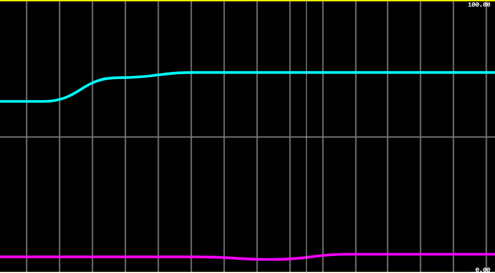
</p>

<p align="center">
  <b>Dados</b><br>
  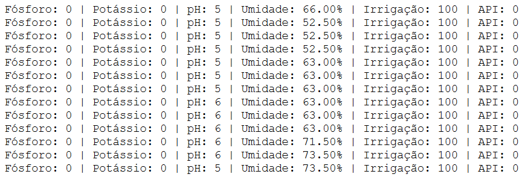
</p>


<br>
* <strong>Oscilação Variável:</strong> Muita variação de umidade que influencia em uma grande variação de pH.
<p align="center">
  <b>Gráfico</b><br>
  
</p>

<p align="center">
  <b>Dados</b><br>
  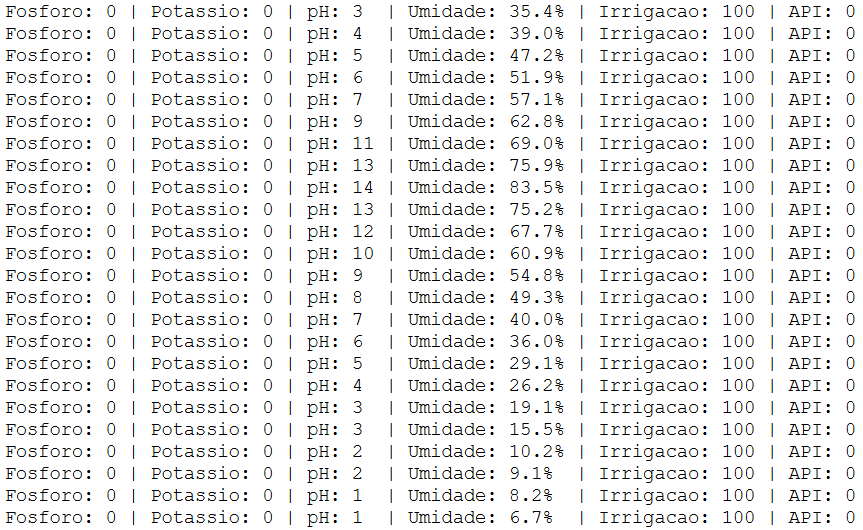
</p>


<br>
* <strong>Variação para Cima:</strong> O aumento da umidade influenciou no aumento do pH.
<p align="center">
  <b>Gráfico</b><br>
  
</p>

<p align="center">
  <b>Dados</b><br>
  
</p>

<br>
* <strong>Variação para Baixo:</strong> O queda da umidade influenciou na redução do pH.
<p align="center">
  <b>Gráfico</b><br>
  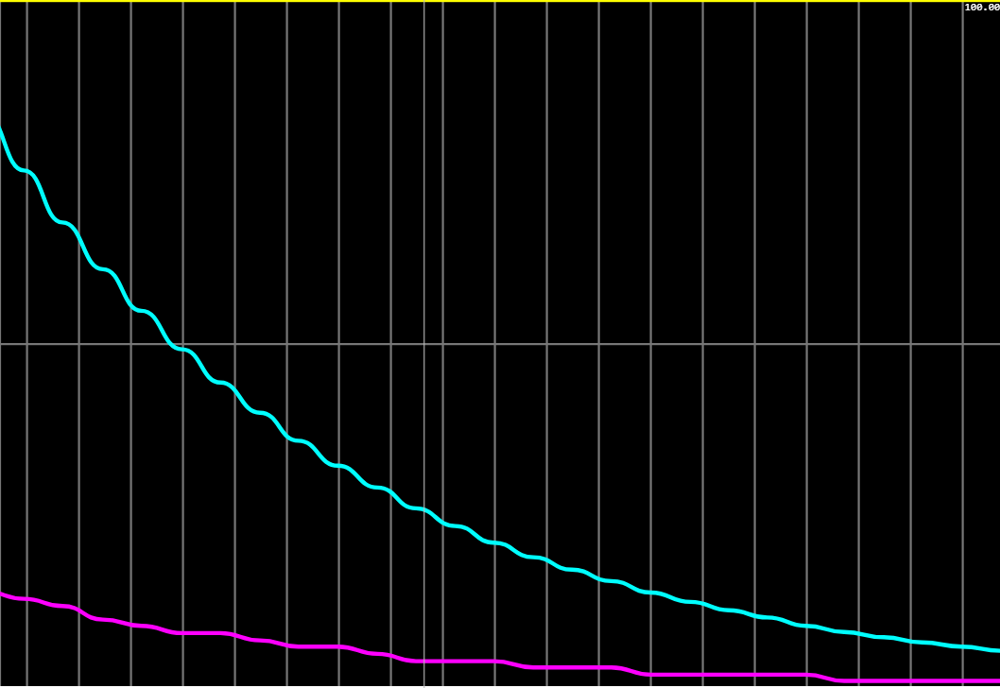
</p>

<p align="center">
  <b>Dados</b><br>
  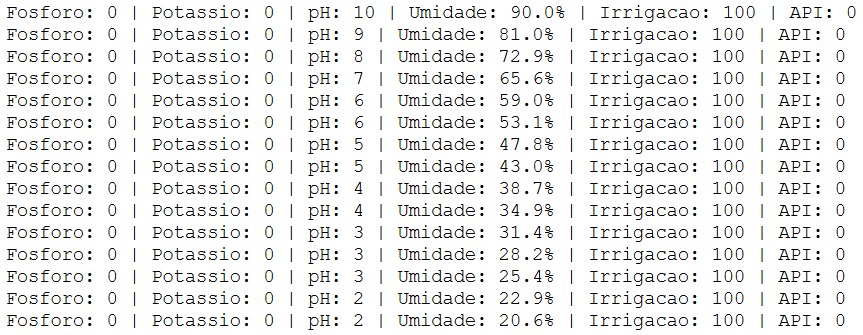
</p>

---

### 3️⃣ Armazenamento de Dados em Banco SQL com Python

O armazenamento dos dados coletados pelos sensores foi implementado em Python, utilizando um banco de dados SQL. O código é responsável por criar tabelas, inserir dados e realizar operações CRUD (Criar, Ler, Atualizar e Deletar) no banco de dados.

### MER

O grupo realizou pequenas mudanças no modelo de banco de dados em relação à entrega anterior. O modelo abaixo representa as tabelas e relacionamentos atuais utilizados para o armazenamento dos dados:

<p align="center">
  <b>Novo</b><br>
  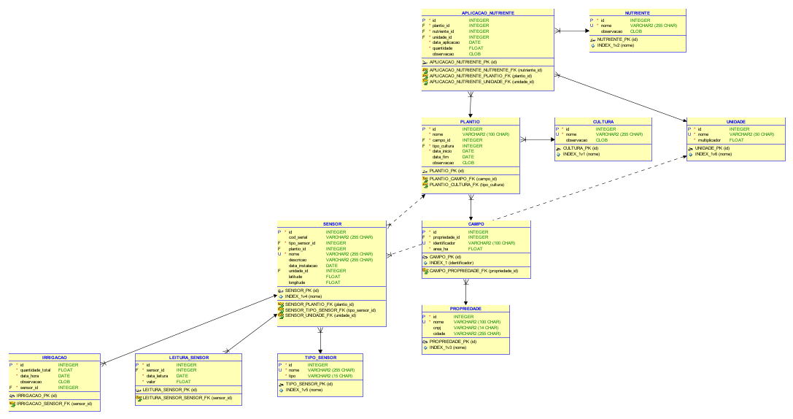
</p>


Novo Modelo de Entidade-Relacionamento:

Tabela: CULTURA
  - id (INTEGER NOT NULL) [PK]
  - nome (VARCHAR(255) NOT NULL)
  - observacao (TEXT(1000))

Tabela: PROPRIEDADE
  - id (INTEGER NOT NULL) [PK]
  - nome (VARCHAR(100) NOT NULL)
  - cnpj (VARCHAR(14))
  - cidade (VARCHAR(255))

Tabela: CAMPO
  - id (INTEGER NOT NULL) [PK]
  - propriedade_id (INTEGER NOT NULL) [FK -> PROPRIEDADE]
  - identificador (VARCHAR(100) NOT NULL)
  - area_ha (FLOAT NOT NULL)

Tabela: PLANTIO
  - id (INTEGER NOT NULL) [PK]
  - nome (VARCHAR(100) NOT NULL)
  - campo_id (INTEGER NOT NULL) [FK -> CAMPO]
  - tipo_cultura (INTEGER NOT NULL) [FK -> CULTURA]
  - data_inicio (DATETIME NOT NULL)
  - data_fim (DATETIME)
  - observacao (TEXT(1000))

Tabela: UNIDADE
  - id (INTEGER NOT NULL) [PK]
  - nome (VARCHAR(50) NOT NULL)
  - multiplicador (FLOAT NOT NULL)

Tabela: TIPO_SENSOR
  - id (INTEGER NOT NULL) [PK]
  - nome (VARCHAR(255) NOT NULL)
  - tipo (VARCHAR(15) NOT NULL)

Tabela: SENSOR
  - id (INTEGER NOT NULL) [PK]
  - cod_serial (VARCHAR(255))
  - tipo_sensor_id (INTEGER NOT NULL) [FK -> TIPO_SENSOR]
  - plantio_id (INTEGER) [FK -> PLANTIO]
  - nome (VARCHAR(255) NOT NULL)
  - descricao (VARCHAR(255))
  - data_instalacao (DATETIME)
  - unidade_id (INTEGER) [FK -> UNIDADE]
  - latitude (FLOAT)
  - longitude (FLOAT)

Tabela: LEITURA_SENSOR
  - id (INTEGER NOT NULL) [PK]
  - sensor_id (INTEGER NOT NULL) [FK -> SENSOR]
  - data_leitura (DATETIME NOT NULL)
  - valor (FLOAT NOT NULL)

Tabela: IRRIGACAO
  - id (INTEGER NOT NULL) [PK]
  - quantidade_total (FLOAT NOT NULL)
  - data_hora (DATETIME NOT NULL)
  - observacao (TEXT(1000))
  - sensor_id (INTEGER NOT NULL) [FK -> SENSOR]

Tabela: NUTRIENTE
  - id (INTEGER NOT NULL) [PK]
  - nome (VARCHAR(255) NOT NULL)
  - observacao (TEXT(1000))

Tabela: APLICACAO_NUTRIENTE
  - id (INTEGER NOT NULL) [PK]
  - plantio_id (INTEGER NOT NULL) [FK -> PLANTIO]
  - nutriente_id (INTEGER NOT NULL) [FK -> NUTRIENTE]
  - unidade_id (INTEGER NOT NULL) [FK -> UNIDADE]
  - data_aplicacao (DATETIME NOT NULL)
  - quantidade (FLOAT NOT NULL)
  - observacao (TEXT(1000))

### Principais alterações realizadas

- Atualização da lista de tabelas e colunas, incluindo campos como cidade em PROPRIEDADE, cod_serial em SENSOR, e ajustes em chaves estrangeiras.

### JUSTIFICATIVA DA ESCOLHA DA ESTRUTURA DE DADOS

A estrutura de dados foi projetada para atender às necessidades de um sistema de gerenciamento agrícola, garantindo flexibilidade, escalabilidade e consistência. Abaixo estão os principais pontos que justificam as escolhas realizadas:

1. **Normalização e Organização**:
   - O modelo segue os princípios de normalização para evitar redundância de dados e garantir integridade referencial.
   - As tabelas foram organizadas de forma a refletir entidades reais do domínio agrícola, como `PLANTIO`, `CAMPO`, `SENSOR` e `NUTRIENTE`.

2. **Flexibilidade**:
   - A inclusão de tabelas como `UNIDADE` e `TIPO_SENSOR` permite a adição de novos tipos de sensores ou unidades de medida sem a necessidade de alterações estruturais significativas.
   - A tabela `OBSERVACAO` em várias entidades permite armazenar informações adicionais sem comprometer a estrutura principal.

3. **Escalabilidade**:
   - O uso de tipos de dados como `FLOAT` e `CLOB` garante que o sistema possa lidar com grandes volumes de dados e informações detalhadas.
   - A separação de tabelas como `LEITURA_SENSOR` e `APLICACAO_NUTRIENTE` permite o registro de eventos históricos, facilitando análises futuras.

4. **Padronização**:
   - Os nomes das tabelas e colunas foram padronizados em maiúsculas para facilitar a leitura e manter consistência.
   - Tipos de dados foram escolhidos com base nas melhores práticas para bancos de dados Oracle, como o uso de `DATE` para datas e `VARCHAR2` para strings.

5. **Relacionamentos Claros**:
   - A utilização de chaves estrangeiras garante a integridade dos dados e define claramente os relacionamentos entre as entidades.
   - Por exemplo, a tabela `PLANTIO` referencia `CAMPO` e `CULTURA`, enquanto `SENSOR` referencia `TIPO_SENSOR` e `PLANTIO`.

6. **Adaptação às Necessidades do Domínio**:
   - A estrutura foi adaptada para refletir as operações agrícolas, como o registro de leituras de sensores, aplicações de nutrientes e irrigação.
   - A inclusão de colunas como `latitude` e `longitude` em `SENSOR` permite a localização geográfica precisa, essencial para análises espaciais.

Essa estrutura foi escolhida para garantir que o sistema seja robusto, fácil de manter e capaz de atender às demandas de um ambiente agrícola em constante evolução.

## Models e Python

Para realizar a conversão das linhas e colunas da database para Python, foram definidas classes as quais são responsáveis por fazer as operações CRUD e demais funcionalidades do banco de dados.
Essas classes podem ser encontradas na pasta `src/database/models`, e todas elas herdam a classe principal chamada [Model](src/database/tipos_base/model.py)


### EXECUTAR O SISTEMA E REALIZAR OPERAÇÕES CRUD

O sistema foi desenvolvido em Python e utiliza um banco de dados Oracle para armazenar os dados. O código é modularizado, permitindo fácil manutenção e expansão.

## 📦 Requisitos
- Python 3.13.2
  - Bibliotecas:
```plaintext
  oracledb==3.1.0
  pandas==2.2.3
  matplotlib==3.10.1
  streamlit==1.44.1
  SQLAlchemy==2.0.40
  fastapi==0.115.12
  pydantic==2.11.5
  uvicorn==0.34.3
  dotenv==0.9.9
  seaborn==0.13.2
  plotly==6.1.2
  joblib==1.5.1
  scikit-learn==1.7.0
  boto3==1.40.41
  ultralytics==8.0.196
  opencv-python==4.8.1.78
  Pillow==10.1.0
```

## 🔗 Instalação
- Para instalar as dependências, utilize o seguinte comando:
    ```bash
    pip install -r requirements.txt
    ```
  
- Para executar o código, utilize o seguinte comando:
    ```bash
    streamlit run main_dash.py
    ```
    > **Nota:** O código foi desenvolvido para rodar em ambiente local, utilizando o Streamlit.


## Arquivo de Configuração

O projeto utiliza um arquivo especial denominado **`.env`** para armazenar variáveis de ambiente sensíveis, como credenciais de banco de dados e chaves de APIs externas. Por razões de segurança, esse arquivo **não deve ser compartilhado publicamente**.

### 🔑 Variáveis Utilizadas

| Variável      | Descrição                                                                                                | Exemplo de Valor                  |
|---------------|----------------------------------------------------------------------------------------------------------|-----------------------------------|
| SQL_LITE      | Define o banco de dados a ser usado (`true` ou `false`)                                                  | `true` ou `false`                 |
| LOGGING_ENABLED      | Define se o logger da aplicação será ativado (`true` ou `false`)                                         | `true` ou `false`                 |
| ENABLE_API      | Define se a API que salva os dados do sensor será ativada juntamente com o dashboard (`true` ou `false`) | `true` ou `false`                 |


### ⚙️ Exemplo de arquivo `.env`

```plaintext
SQL_LITE=true
LOGGING_ENABLED=true
ENABLE_API=true
```

- Se `SQL_LITE=true`, o sistema usará o banco SQLite local.
- Se `SQL_LITE=false`, será utilizado o banco Oracle da FIAP (o sistema apresentará uma tela de login para colocar o usuário e senha do banco de dados).

## Login

Ao executar o sistema, se foi setado o SQL_LITE como `false`, primeiramente você verá uma tela de login para inserir o usuário e senha do banco de dados Oracle da FIAP. Após o login, você terá acesso ao dashboard, onde poderá visualizar os dados coletados pelos sensores, gerar posts informativos e monitorar as condições ambientais em tempo real.

<p align="center">
  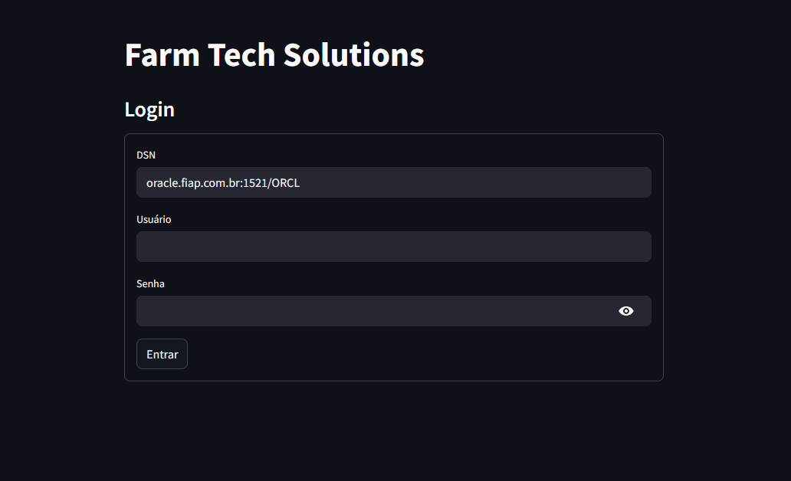
</p>

- DSN: `oracle.fiap.com.br:1521/ORCL`
- Usuário: `seu usuario no banco de dados da FIAP`
- Senha: `sua senha no banco de dados da FIAP`

- Após o login, o usuário será direcionado para a tela inicial do sistema.

## Realizando operações CRUD
- O sistema permite realizar operações CRUD (Criar, Ler, Atualizar e Deletar) em todas as tabelas do banco de dados.
- As operações são realizadas através de formulários, onde o usuário pode inserir os dados necessários.
- Após a inserção dos dados, o sistema irá validar as informações e realizar a operação no banco de dados.
- O sistema também permite visualizar os dados cadastrados, editar e excluir registros.
- As operações são realizadas através de menus, onde o usuário pode selecionar a operação desejada.

## Leitura de dados (READ)

Para realizar uma operação de leitura, basta o usário selecionar um dos modelos disponíveis no menu principal. O sistema irá exibir os dados cadastrados na tabela selecionada.

<p align="center">
  
</p>

💡 Exemplo de consulta SQL para operação READ:
```sql
SELECT "PROPRIEDADE".id, "PROPRIEDADE".nome, "PROPRIEDADE".cnpj
FROM "PROPRIEDADE" ORDER BY "PROPRIEDADE".id
```

## Criação de dados (CREATE)
Para realizar uma operação de criação, basta o usário selecionar um dos modelos disponíveis no menu principal e clicar no botão "Novo". 
O sistema irá exibir um formulário para o usuário preencher os dados necessários. Esse formulário irá variar de acordo com o modelo selecionado.
O sistema irá validar os dados e realizar a operação no banco de dados.

<p align="center">
  
</p>

<p align="center">
  
</p>

<p align="center">
  
</p>

💡 Exemplo de operação CREATE:
```sql
INSERT INTO "PROPRIEDADE" (id, nome, cnpj) VALUES ("PROPRIEDADE_SEQ_ID".nextval, 'Nova Propriedade', NULL) RETURNING "PROPRIEDADE".id INTO :ret_0
```

## Atualização de dados (UPDATE)
Para realizar uma operação de atualização, basta o usário selecionar um dos modelos disponíveis no menu principal, selecionar uma das linhas e clicar no botão "Editar".
O sistema irá exibir um formulário com os dados cadastrados. O usuário pode alterar os dados e clicar no botão "Salvar" para atualizar o registro no banco de dados.

<p align="center">
  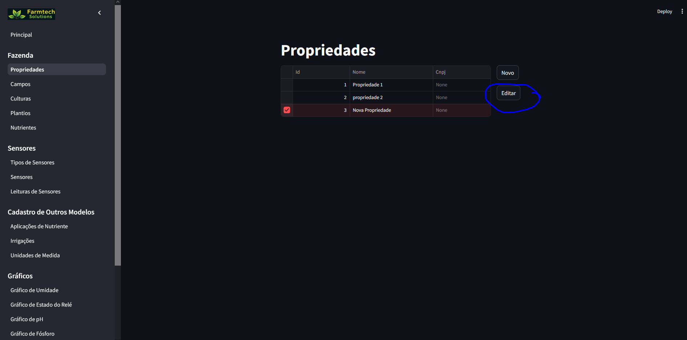
<p>

<p align="center">
  
<p>

<p align="center">
  
</p>


💡 Exemplo de operação UPDATE:
```sql
 UPDATE "PROPRIEDADE" SET nome='Update propriedade' WHERE "PROPRIEDADE".id = 3
```


## Exclusão de dados (DELETE)
Para realizar uma operação de exclusão, basta o usário selecionar um dos modelos disponíveis no menu principal, selecionar uma das linhas e clicar no botão "Editar" e posteriormente "Excluir".

<p align="center">
  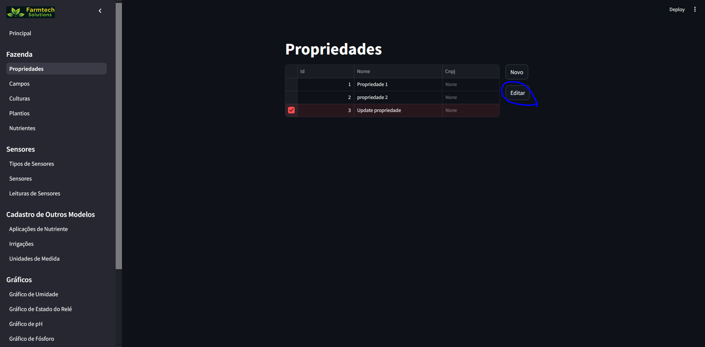
<p>

<p align="center">
  
<p>

<p align="center">
  
</p>

💡 Exemplo de operação DELETE:
```sql
DELETE FROM "PROPRIEDADE" WHERE "PROPRIEDADE".id = 3
```

## Importar Tabelas com os dados

As tabelas com os dados utilizados no sistema podem ser encontradas na pasta em `assets/database_export.zip`.

O arquivo zip contém os arquivos no formato CSV, que podem ser importados para o banco de dados utilizando o dashboard, conforme passos abaixo.

> **Nota:** Os dados das leituras do sensor estão datados de **15/05/2025** até **20/05/2025**.

1. O usuário deve selecionar a opção "Importar Banco de Dados" no menu principal.
<p align="center">
  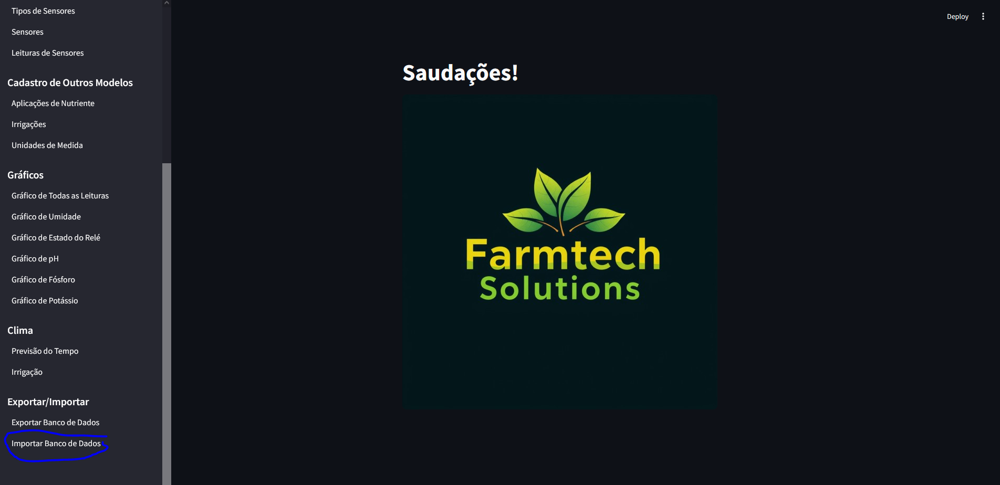
</p>

2. Selecione o arquivo ZIP localizado em `assets/database_export.zip`, espere carregar, role a página até o final e clique no botão "Salvar no Banco de Dados".
<p align="center">
  
</p>

3. Não feche a janela e espere a operação ser concluída. Após a conclusão, o sistema irá exibir uma mensagem de sucesso. Caso ocorra algum erro, tente novamente.

<p align="center">
  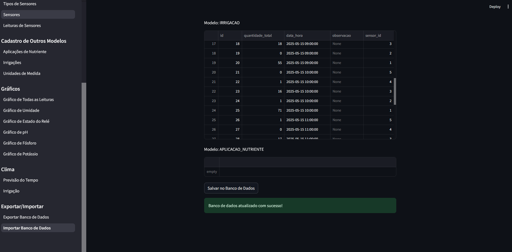
</p>

# Dashboard em Python para Visualização dos Dados

O projeto inclui um dashboard desenvolvido em Python, utilizando a biblioteca Streamlit, que permite visualizar os dados armazenados no banco de dados de forma interativa e amigável. O dashboard apresenta gráficos e tabelas que facilitam a análise dos dados coletados pelos sensores.

## Atualizações de registro no Dashboard

Conforme solicitado no enunciado, o dashboard permite realizar atualizações de registro diretamente na interface. O usuário pode selecionar um registro, editar os dados e salvar as alterações, que serão refletidas no banco de dados.

Para atualizar a leitura de um sensor, o usario deverá selecionar a opção "Leituras de Sensores" no menu principal. Em seguida, o usuário pode clicar no botão "Editar" para modificar os dados de uma leitura específica.
Após realizar as alterações, o usuário deve clicar no botão "Salvar" para atualizar o registro no banco de dados, conforme mencionado nas operações CRUD.

<p align="center">
  
</p>

## Visualização de gráficos reais ou simulados

O dashboard também inclui gráficos que representam os dados coletados pelos sensores. Esses gráficos podem ser gerados a partir de dados reais ou simulados, dependendo da opção selecionada.

Para visualizar os gráficos o usuário deve selecionar uma das opções de "Gráficos" no menu principal. 
A seguir, o usario deverá selecionar o sensor ou sensores desejados, data inicial e data final.
Posteriormente, o usuário deve clicar no botão "Gerar Simulação" para visualizar dados simulados ou "Gerar Gráfico" para visualizar dados reais.

<p align="center">
  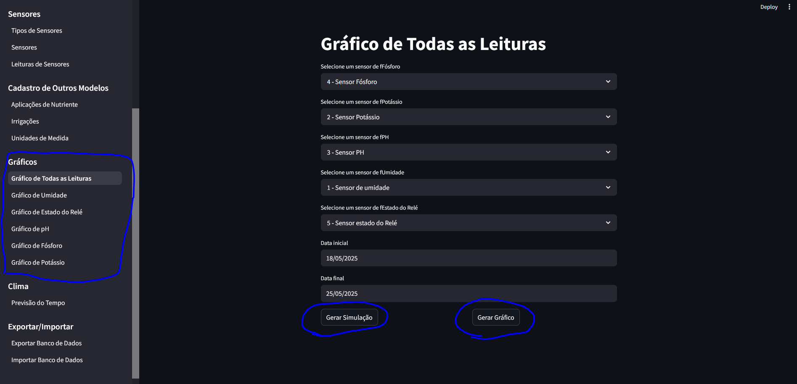
</p>
<p align="center">
  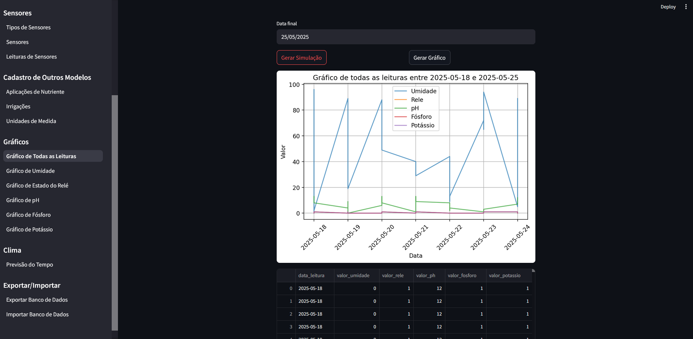
</p>

## Possíveis Erros que podem ocorrer durante a execução do sistema

- **Erro de Conexão com o Banco de Dados [WinError 10054]**: Caso ocorra este erro, a solução é clicar em outra opção do menu para que o sistema reinicie a conexão com o banco de dados.
<p align="center">
  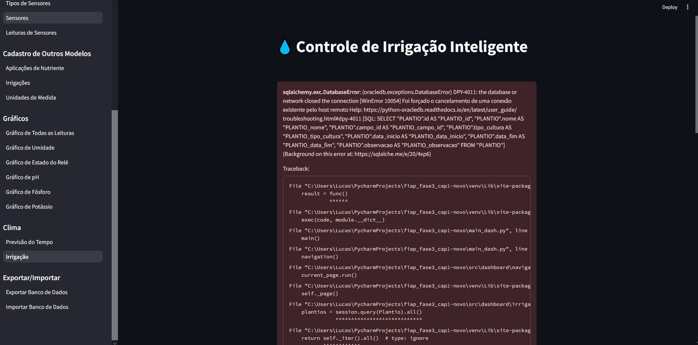
</p>

# Incorporação do Scikit-learn

O grupo realizou treinamento de modelos preditivos para aprimorar a lógica de irrigação.

O arquivo de treinamento do modelo pode ser encontrado em [treinamento_modelos.ipynb](src/modelo_preditivo/treinamento_modelos.ipynb)

## Exploração de Dados

No dashboard foi disponibilizada uma view com informações básicas para a exploração de dados do dataset de treinamento do modelo, conforme imagens abaixo:

<p align="center">
  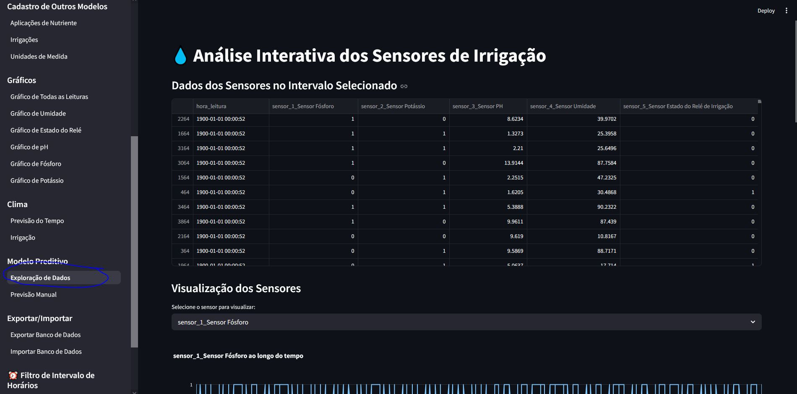
</p>

<p align="center">
  
</p>

<p align="center">
  
</p>

<p align="center">
  
</p>

## Previsão Manual de Irrigação

O dashboard também permite que o usuário faça previsões manuais de irrigação, inseririndo os valores de umidade, pH, potássio e fósforo, e o sistema irá calcular se a irrigação deve ser ativada ou não, conforme pode ser verificado no print abaixo:


<p align="center">
  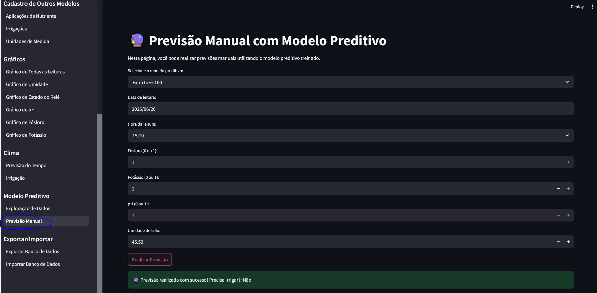
</p>

### Notificação por E-mail de Resultados de Previsão

O sistema de previsão manual oferece funcionalidade integrada de notificação por e-mail, permitindo que os usuários recebam alertas automáticos sobre os resultados das previsões de irrigação.

#### Funcionalidades da Notificação

- **Envio Opcional**: O usuário pode optar por enviar ou não o e-mail através de um checkbox
- **Personalização Completa**: Assunto e mensagem do e-mail são totalmente editáveis
- **Notificação para Todos os Resultados**: E-mails são enviados tanto para resultados "Sim" (irrigação necessária) quanto "Não" (irrigação não necessária)
- **Indicadores Visuais**: O assunto do e-mail inclui indicadores visuais automáticos:
  - ✅ Irrigação Necessária (quando a previsão é "Sim")
  - ⛔ Irrigação Não Necessária (quando a previsão é "Não")

#### Como Utilizar

1. **Preencher os Parâmetros de Previsão**: Insira os valores de umidade, pH, potássio e fósforo
2. **Habilitar Notificação**: Marque a opção "Enviar notificação por e-mail após a previsão"
3. **Personalizar (Opcional)**: Edite o assunto e mensagem do e-mail conforme necessário
4. **Realizar Previsão**: Clique no botão "Realizar Previsão"
5. **Confirmação**: O sistema exibirá o resultado da previsão e confirmará o envio do e-mail

#### Configuração Necessária

Para utilizar a funcionalidade de notificação por e-mail, é necessário configurar as seguintes variáveis de ambiente no arquivo `.env`:

| Variável       | Descrição                                           | Exemplo de Valor                          |
|----------------|-----------------------------------------------------|-------------------------------------------|
| SNS_TOPIC_ARN  | ARN do tópico SNS da AWS para envio de e-mails      | `arn:aws:sns:us-east-1:123456789012:topic` |
| SNS_REGION     | Região da AWS onde o tópico SNS está configurado    | `us-east-1`                               |

#### Validações Implementadas

O sistema implementa as seguintes validações para garantir o envio correto dos e-mails:

- **Campos Obrigatórios**: Verifica se assunto e mensagem não estão vazios
- **Limite de Caracteres**: Valida que o assunto não excede 100 caracteres (limite do AWS SNS), considerando os sufixos automáticos
- **Variáveis de Ambiente**: Exibe aviso se as credenciais AWS SNS não estiverem configuradas
- **Feedback Visual**: Mensagens claras de sucesso ou erro são exibidas ao usuário

#### Conteúdo Padrão do E-mail

Quando habilitada, a notificação inclui automaticamente:

- **Assunto Padrão**: "Resultado da Previsão de Irrigação" + indicador visual do resultado
- **Mensagem Padrão**: Inclui todos os parâmetros utilizados na previsão (data/hora, fósforo, potássio, pH, umidade) e o resultado da análise

#### Exemplo de E-mail Enviado

**Assunto**: Resultado da Previsão de Irrigação - ✅ Irrigação Necessária

**Mensagem**:
```
A previsão de irrigação foi realizada com os seguintes parâmetros:

Data/Hora: 2025-05-20 14:30:00
Fósforo: 1
Potássio: 1
pH: 1
Umidade: 45.5

Precisa Irrigar?: Sim
```

#### Integração com AWS SNS

O sistema utiliza o serviço Amazon Simple Notification Service (SNS) para o envio de e-mails, garantindo:

- **Confiabilidade**: Alta disponibilidade e entrega garantida
- **Escalabilidade**: Suporte para múltiplos destinatários através de tópicos SNS
- **Rastreabilidade**: Cada e-mail enviado retorna um ID único de mensagem

Para mais detalhes sobre a implementação, consulte o arquivo [previsoes.py](src/dashboard/modelo_preditivo/previsoes.py).

## Previsão automática e integração com o ESP32

Conforme citado anteriormente, o projeto foi estruturado para permitir a integração com o ESP32, possibilitando que o dispositivo envie leituras de sensores e receba decisões de irrigação.

Esta previsão automática é realizada através de uma API que recebe os dados dos sensores e utiliza um modelo preditivo treinado para decidir se a irrigação deve ser ativada ou não, conforme pode ser verificado no arquivo [prever_irrigacao.py](src/wokwi_api/prever_irrigacao.py)

# Detecção de Objetos com Modelos YOLO

O projeto agora inclui uma funcionalidade completa de detecção de objetos utilizando modelos YOLO (You Only Look Once) treinados. Esta funcionalidade permite aos usuários treinar modelos personalizados e utilizá-los diretamente no dashboard para análise de imagens em tempo real.

## Notebooks de Treinamento YOLO

No diretório `src/modelo_yolo/`, encontram-se três notebooks Jupyter para treinamento de modelos:

1. **yolo_padrao_fiap.ipynb** - Treinamento com YOLO padrão (Ultralytics YOLOv8)
   - Utiliza YOLOv8s (small) como base
   - Configuração otimizada para datasets personalizados
   - Treinamento com 150 épocas e early stopping (patience=30)
   - Suporte para GPU (device=0) e CPU

2. **yolo7.ipynb** - Treinamento com YOLOv7
   - Implementação alternativa usando YOLOv7
   - Adequado para casos específicos de detecção

3. **CNN.ipynb** - Treinamento com Redes Neurais Convolucionais
   - Abordagem alternativa usando CNN personalizada
   - Útil para comparação de desempenho

### Formato dos Modelos Treinados

Os modelos YOLO são salvos no formato `.pt` (PyTorch), que contém:
- Pesos do modelo treinado
- Arquitetura da rede neural
- Metadados do treinamento (classes, hiperparâmetros)
- Configurações de normalização

### Workflow de Treinamento

1. **Preparação do Dataset**
   - Organize suas imagens e anotações
   - Crie um arquivo `data.yaml` com as configurações:
     ```yaml
     path: /caminho/para/dataset
     train: images/train
     val: images/val
     test: images/test
     
     names:
       0: classe1
       1: classe2
       # ... mais classes
     ```

2. **Treinamento do Modelo**
   - Abra um dos notebooks em `src/modelo_yolo/`
   - Configure os parâmetros de treinamento:
     - `epochs`: Número de épocas (padrão: 150)
     - `imgsz`: Tamanho da imagem (padrão: 640)
     - `batch`: Tamanho do batch (padrão: 16)
     - `patience`: Early stopping (padrão: 30)
   - Execute o treinamento
   - O modelo será salvo automaticamente como `best.pt`

3. **Salvamento do Modelo**
   - Após o treinamento, copie o arquivo `best.pt` para:
     ```
     src/modelo_yolo/modelos_treinados/
     ```
   - Renomeie o arquivo para algo descritivo, ex: `yolo_frutas_v1.pt`

## Inferência YOLO no Dashboard

O dashboard agora inclui uma página dedicada para realizar inferência com modelos YOLO treinados.

### Como Acessar

1. Execute o dashboard: `streamlit run main_dash.py`
2. No menu lateral, navegue até **"Modelo YOLO" → "Inferência YOLO"**

### Funcionalidades da View de Inferência

#### 1️⃣ Seleção do Modelo
- **Lista de modelos**: Exibe todos os modelos `.pt` disponíveis em `src/modelo_yolo/modelos_treinados/`
- **Upload de modelo**: Permite fazer upload de novos modelos diretamente pelo dashboard
- **Informações do modelo**: Exibe nome e tamanho do arquivo

#### 2️⃣ Upload de Imagem
- **Formatos suportados**: JPG, JPEG, PNG, BMP
- **Preview**: Visualização da imagem original antes da inferência
- **Suporte para múltiplas imagens**: Processe uma imagem por vez

#### 3️⃣ Configurações de Detecção
Ajuste os parâmetros de detecção para otimizar os resultados:

- **Confiança Mínima** (0.0 - 1.0, padrão: 0.25)
  - Define o limiar de confiança para aceitar uma detecção
  - Valores mais altos = menos detecções, mais precisas
  - Valores mais baixos = mais detecções, podem incluir falsos positivos

- **IoU (NMS)** (0.0 - 1.0, padrão: 0.45)
  - Limiar de Intersection over Union para Non-Maximum Suppression
  - Remove detecções duplicadas/sobrepostas
  - Valores mais altos = mantém mais detecções sobrepostas

- **Detecções Máximas** (1 - 1000, padrão: 300)
  - Número máximo de objetos detectados por imagem
  - Útil para limitar processamento em imagens com muitos objetos

#### 4️⃣ Resultados da Detecção

Após clicar em **"🚀 Detectar Objetos"**, o sistema exibe:

1. **Imagem Anotada**
   - Bounding boxes coloridos ao redor dos objetos detectados
   - Labels com nome da classe e porcentagem de confiança
   - Visualização lado a lado com a imagem original

2. **Métricas de Detecção**
   - Total de detecções encontradas
   - Confiança média das detecções
   - Confiança máxima atingida

3. **Tabela de Detecções**
   - Lista detalhada de cada objeto detectado
   - Informações incluem:
     - Número da detecção
     - Classe/categoria do objeto
     - Porcentagem de confiança
     - Coordenadas do bounding box (x1, y1, x2, y2)

4. **Download da Imagem Anotada**
   - Botão para baixar a imagem com as detecções desenhadas
   - Formato PNG de alta qualidade
   - Nome do arquivo preservado com prefixo "deteccoes_"

### Exemplo de Uso

```python
# 1. Treine seu modelo (nos notebooks)
# 2. Salve em src/modelo_yolo/modelos_treinados/meu_modelo.pt
# 3. No dashboard:
#    - Selecione "Inferência YOLO"
#    - Escolha "meu_modelo"
#    - Faça upload de uma imagem
#    - Ajuste parâmetros se necessário
#    - Clique em "Detectar Objetos"
# 4. Visualize resultados e baixe a imagem anotada
```

## Estrutura de Arquivos YOLO

```
src/
├── modelo_yolo/
│   ├── yolo_padrao_fiap.ipynb    # Notebook de treinamento
│   ├── yolo7.ipynb               # Alternativa com YOLOv7
│   ├── CNN.ipynb                 # Alternativa com CNN
│   ├── model_loader.py           # Utilitário de carregamento
│   └── modelos_treinados/        # Diretório para modelos .pt
│       ├── README.md             # Instruções de uso
│       ├── .gitkeep              # Mantém diretório no git
│       └── seu_modelo.pt         # Seus modelos treinados
└── dashboard/
    └── modelo_yolo/
        ├── __init__.py
        └── inference_view.py     # View de inferência no dashboard
```

## Dependências Adicionais

As seguintes bibliotecas foram adicionadas ao `requirements.txt` para suportar a funcionalidade YOLO:

```
ultralytics==8.0.196      # Framework YOLO oficial
opencv-python==4.8.1.78   # Processamento de imagens
Pillow==10.1.0            # Manipulação de imagens
```

Para instalar:
```bash
pip install -r requirements.txt
```

## Troubleshooting

### Modelo não aparece na lista
- Verifique se o arquivo `.pt` está em `src/modelo_yolo/modelos_treinados/`
- Recarregue a página do dashboard (F5)

### Erro ao carregar modelo
- Certifique-se de que o arquivo não está corrompido
- Verifique se você tem memória RAM suficiente
- Modelos grandes (>100MB) podem demorar para carregar

### Nenhum objeto detectado
- Tente diminuir o limite de confiança (ex: 0.15)
- Verifique se o modelo foi treinado para detectar os objetos na imagem
- Certifique-se de que a imagem tem boa qualidade e iluminação

### Muitos falsos positivos
- Aumente o limite de confiança (ex: 0.5 ou mais)
- Ajuste o threshold de IoU
- Considere retreinar o modelo com mais dados

## Recursos Avançados

### Cache de Modelos
O sistema implementa cache automático de modelos carregados, melhorando significativamente o desempenho em inferências subsequentes com o mesmo modelo.

### Otimização de Performance
- Modelos são carregados sob demanda (lazy loading)
- Cache de modelos mantido durante a sessão
- Suporte para GPU quando disponível
- Processamento otimizado de imagens

### Logs e Debugging
Em modo de desenvolvimento (`DEBUG=true` no `.env`), logs detalhados são exibidos para facilitar o debugging.

# Integração Python com API Pública

Para acessar a api o usuário deverá selecionar as opções "Previsão do Tempo" ou "Irrigação" no menu principal.

<p align="center">
  
</p>

<p align="center">
  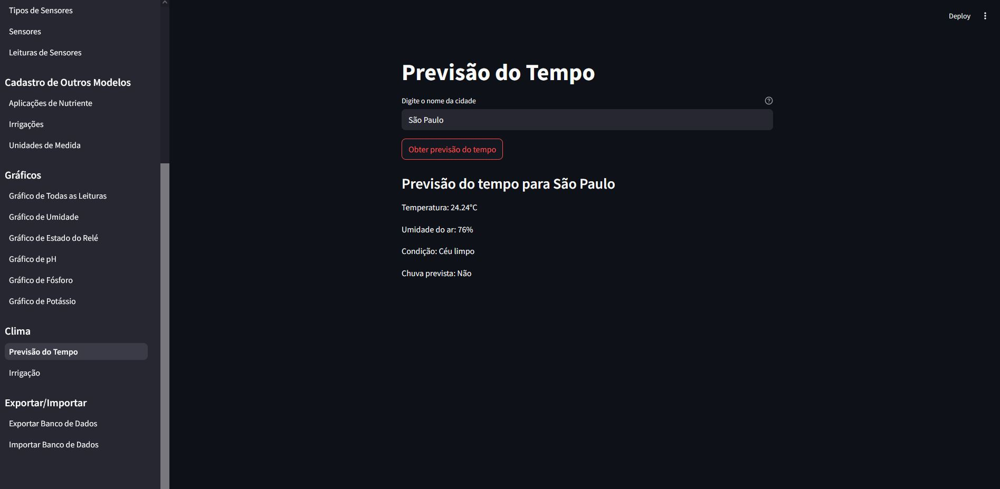
</p>

<p align="center">
  
</p>


## Funcionamento API

#  1. Objetivo
  Fornecer dados meteorológicos para auxiliar na decisão de irrigação automática, integrando-se com sensores locais e o sistema de controle.

# 2. Endpoints Principais

  GET /previsao?cidade={cidade}
  Retorna:
  {
    "temperatura": 25.5,
    "umidade_ar": 65,
    "chuva": false,
    "condicao": "Ensolarado"
  }

# 3. Parâmetros de Decisão

  A API considera:
  Umidade do solo (<30% = irrigar)
  Previsão de chuva (se true = não irrigar)
  pH do solo (5.5 a 7.0 = ideal)

# 4. Fluxo Típico

  Sistema envia cidade do plantio
  API retorna condições climáticas
  Lógica local combina com dados de sensores
  Toma decisão de irrigação

# 5. Exemplo de Uso

  python
  dados = obter_dados_clima("Campinas")
  if not dados["chuva"] and umidade_solo < 30:
      acionar_irrigacao()

# 6. Requisitos
  Chave API válida
  Conexão internet
  Formato cidade: "Cidade,UF" (opcional)

# 7. Segurança
  Limite: 60 chamadas/minuto
  Dados criptografados em trânsito

## 8. Códigos de Erro

  401: Chave inválida
  404: Cidade não encontrada
  429: Limite excedido

---

# Mensageria AWS SNS - Sistema de Alertas Automáticos

O sistema FarmTech Solutions implementa um serviço de mensageria automática utilizando **Amazon SNS (Simple Notification Service)** para enviar alertas em tempo real quando leituras críticas dos sensores são detectadas. Esta funcionalidade garante que os gestores agrícolas sejam notificados imediatamente sobre condições que requerem atenção.

## 📋 Visão Geral

O sistema de alertas monitora continuamente as leituras dos sensores e dispara notificações por e-mail quando condições críticas são identificadas. As notificações são enviadas através do AWS SNS, um serviço de mensageria gerenciado, escalável e confiável.

### Principais Características

- ✅ **Alertas Automáticos**: Disparo automático baseado em regras de negócio
- ✅ **Consolidação**: Múltiplas condições críticas em um único alerta
- ✅ **Throttling Inteligente**: Intervalo mínimo de 15 minutos entre alertas do mesmo sensor
- ✅ **Integração Boto3**: Uso da biblioteca oficial AWS para Python
- ✅ **Zero Configuração no Código**: Configuração via variáveis de ambiente

## 🔧 Configuração AWS SNS

### Pré-requisitos

- Conta AWS ativa
- AWS CLI configurado (opcional, mas recomendado)
- Credenciais AWS com permissões para SNS

### Passo 1: Criar um Tópico SNS

1. Acesse o console AWS e navegue até o serviço **SNS**
2. No menu lateral, clique em **Topics** (Tópicos)
3. Clique no botão **Create topic** (Criar tópico)
4. Selecione o tipo **Standard**
5. Defina um nome para o tópico, por exemplo: `sensor-alerts-farmtech`
6. Mantenha as configurações padrão e clique em **Create topic**

**[PRINT 1 - Criação do Tópico]**
_Placeholder: Captura de tela mostrando a página de criação do tópico SNS com o nome "sensor-alerts-farmtech" configurado_

### Passo 2: Copiar o ARN do Tópico

1. Após criar o tópico, você será redirecionado para a página de detalhes
2. Localize o campo **ARN** (Amazon Resource Name)
3. Copie o valor do ARN, que terá um formato similar a:
   ```
   arn:aws:sns:us-east-1:123456789012:sensor-alerts-farmtech
   ```
4. Guarde este valor, pois será usado na configuração das variáveis de ambiente

**[PRINT 2 - ARN do Tópico]**
_Placeholder: Captura de tela destacando o campo ARN na página de detalhes do tópico_

### Passo 3: Criar uma Subscription (Inscrição)

1. Na página de detalhes do tópico, clique na aba **Subscriptions**
2. Clique no botão **Create subscription**
3. Configure a subscription:
   - **Protocol**: Selecione `Email`
   - **Endpoint**: Insira o endereço de e-mail que receberá os alertas
4. Clique em **Create subscription**

**[PRINT 3 - Subscription Pendente]**
_Placeholder: Captura de tela mostrando a subscription criada com status "Pending confirmation"_

### Passo 4: Confirmar a Subscription

1. Acesse a caixa de entrada do e-mail cadastrado
2. Procure por um e-mail da AWS SNS com assunto "AWS Notification - Subscription Confirmation"
3. Abra o e-mail e clique no link **Confirm subscription**
4. Uma página web será aberta confirmando a inscrição

**[PRINT 4 - Confirmação de Subscription]**
_Placeholder: Captura de tela do e-mail de confirmação da AWS e/ou a página de confirmação bem-sucedida_

### Passo 5: Configurar Variáveis de Ambiente

Edite o arquivo `.env` na raiz do projeto e adicione as seguintes variáveis:

```bash
# Configurações AWS SNS
SNS_REGION=us-east-1
SNS_TOPIC_ARN=arn:aws:sns:us-east-1:123456789012:sensor-alerts-farmtech
```

**Importante:** Substitua os valores acima pelos valores reais da sua configuração AWS.

Um arquivo `.env.example` está disponível no projeto como referência.

## 📊 Critérios de Alerta

O sistema avalia as seguintes condições para determinar se um alerta deve ser enviado:

| Sensor/Condição | Critério de Alerta | Descrição |
|-----------------|-------------------|-----------|
| **Umidade** | `< 60%` | Umidade do solo abaixo do nível crítico |
| **pH** | `< 6.0` ou `> 7.0` | pH fora da faixa ideal para cultivo |
| **Fósforo** | `valor = 0` (False) | Nível crítico de fósforo no solo |
| **Potássio** | `valor = 0` (False) | Nível crítico de potássio no solo |
| **Irrigação** | `valor = 1` (True) | Sistema de irrigação foi ativado |

### Exemplo de Avaliação

Considere uma leitura com os seguintes valores:
- Umidade: 55% ⚠️
- pH: 5.5 ⚠️
- Fósforo: 0 (Crítico) ⚠️
- Potássio: 1 (OK) ✓
- Irrigação: 1 (Ativa) ⚠️

Neste cenário, **4 condições críticas** foram detectadas, e um **único alerta consolidado** será enviado.

## 📧 Formato das Notificações

### Assunto do E-mail

```
[ALERTA SENSOR 123] Condições Críticas Detectadas
```

### Corpo do E-mail

```
ALERTA AUTOMÁTICO - SENSOR 123

⚠️ CONDIÇÕES CRÍTICAS DETECTADAS ⚠️

Timestamp: 2025-11-22T19:30:00Z

Condições críticas identificadas:
  1. Umidade baixa (55.0%) < 60%
  2. pH fora da faixa (5.50) - Ideal: 6.0–7.0
  3. Fósforo crítico
  4. Irrigação ativada

Valores atuais:
  - Umidade: 55.0% ⚠️
  - pH: 5.50 ⚠️
  - Fósforo: CRÍTICO ⚠️
  - Potássio: OK ✓
  - Irrigação: ATIVA ⚠️

---
Este é um alerta automático gerado pelo sistema de monitoramento de sensores.
Próximo alerta poderá ser enviado após 15 minutos.
```

**[PRINT 5 - Exemplo de E-mail Recebido]**
_Placeholder: Captura de tela de um e-mail real recebido com alerta de sensor, mostrando o assunto e corpo completo_

## 🔄 Funcionamento do Sistema

### Fluxo de Alertas

1. **Recepção de Leitura**: O ESP32 envia dados dos sensores para a API (`/leitura/`)
2. **Persistência**: Os dados são salvos no banco de dados
3. **Avaliação**: O módulo `alertas.py` avalia as condições críticas
4. **Consolidação**: Múltiplas condições são agrupadas em um único alerta
5. **Throttling**: Verifica se já foi enviado alerta recente (< 15 minutos)
6. **Envio**: Se aprovado, publica no tópico SNS via `enviar_email()`
7. **Notificação**: Subscribers recebem o e-mail automaticamente

### Diagrama de Fluxo

```
ESP32 → API /leitura/ → Banco de Dados → avaliar_condicoes()
                                              ↓
                                    Condições Críticas?
                                              ↓
                                         Sim ↓ Não → FIM
                                              ↓
                                    Throttling OK?
                                              ↓
                                         Sim ↓ Não → FIM
                                              ↓
                                    publicar_alerta_sensor()
                                              ↓
                                        AWS SNS Topic
                                              ↓
                                      E-mail Subscriber
```

## 🎛️ Throttling e Consolidação

### Throttling (15 minutos)

Para evitar spam de notificações, o sistema implementa um mecanismo de **throttling**:

- **Intervalo Mínimo**: 15 minutos entre alertas do mesmo sensor
- **Armazenamento**: In-memory (dicionário Python)
- **Chave**: `sensor_id`
- **Valor**: Timestamp do último alerta enviado

**Comportamento:**
- Se um alerta foi enviado há menos de 15 minutos, novos alertas são **bloqueados**
- Após 15 minutos, o sensor pode enviar um novo alerta
- Cada sensor tem seu próprio timer independente

**Limitação:** O controle in-memory é perdido ao reiniciar a aplicação. Para ambientes de produção, considere usar Redis ou cache persistente.

### Consolidação de Múltiplas Condições

Quando várias condições críticas ocorrem simultaneamente, o sistema:

1. **Coleta** todas as condições críticas detectadas
2. **Agrupa** em uma única mensagem
3. **Enumera** cada condição de forma clara
4. **Envia** apenas uma notificação

**Benefício:** Reduz ruído e facilita a leitura pelo gestor, que recebe um panorama completo da situação em um único e-mail.

## 📁 Estrutura de Código

### Módulos Principais

#### `src/notificacoes/email.py`
Funções base para integração com AWS SNS usando boto3:
- `enviar_email(assunto, mensagem)`: Publica mensagem no tópico SNS
- `subscribe_email(email)`: Adiciona novo subscriber ao tópico

#### `src/notificacoes/alertas.py` (NOVO)
Lógica de avaliação e disparo de alertas:
- `avaliar_condicoes()`: Avalia leituras e retorna lista de condições críticas
- `publicar_alerta_sensor()`: Consolida condições e envia alerta via SNS
- `obter_status_throttling()`: Retorna status de throttling de um sensor
- `limpar_historico_alertas()`: Limpa histórico (útil para testes)

#### `src/wokwi_api/receber_leitura.py` (MODIFICADO)
API que recebe leituras do ESP32 e dispara avaliação de alertas:
- Após salvar leituras no banco, chama `publicar_alerta_sensor()`
- Erros no envio de alertas não interrompem o fluxo principal

### Exemplo de Uso Programático

```python
from src.notificacoes.alertas import publicar_alerta_sensor

# Simular leitura crítica
alerta_enviado = publicar_alerta_sensor(
    sensor_id=1,
    umidade=55.0,
    ph=5.5,
    fosforo_ok=False,
    potassio_ok=True,
    irrigacao_ativa=True
)

if alerta_enviado:
    print("Alerta enviado com sucesso!")
else:
    print("Alerta não enviado (sem condições críticas ou throttling ativo)")
```

## 🧪 Testando o Sistema

### Teste via Dashboard

1. Acesse o dashboard Streamlit
2. Navegue até **Notificações** → **Subscrever E-mail**
3. Insira seu e-mail e clique em **Subscrever E-mail**
4. Confirme a subscription no e-mail recebido
5. Clique em **Enviar E-mail de Teste** para verificar o funcionamento

### Teste via API (Simulação de ESP32)

Use o seguinte payload para simular uma leitura crítica:

```bash
curl -X POST "http://localhost:8180/leitura/" \
  -H "Content-Type: application/json" \
  -d '{
    "serial": "ABC123",
    "umidade": 55.0,
    "ph": 5.5,
    "estado_fosforo": 0,
    "estado_potassio": 1,
    "estado_irrigacao": 1
  }'
```

**Resultado esperado:** Um alerta consolidado deve ser enviado para os subscribers do tópico SNS.

## 🔮 Sugestões de Evolução Futura

### Integrações Avançadas

1. **Amazon SQS (Simple Queue Service)**
   - Enfileirar alertas para processamento assíncrono
   - Garantir entrega mesmo em caso de falhas temporárias
   - Separar lógica de avaliação e envio

2. **Amazon EventBridge**
   - Criar regras baseadas em eventos
   - Integrar com múltiplos destinos (Lambda, SNS, SQS)
   - Facilitar arquitetura orientada a eventos

3. **Amazon CloudWatch**
   - Monitorar métricas de alertas (quantidade, frequência)
   - Criar dashboards de observabilidade
   - Configurar alarmes sobre o próprio sistema de alertas

### Melhorias no Sistema

- **Persistência de Histórico**: Tabela `ALERTAS` no banco de dados
- **Níveis de Severidade**: Alertas críticos, warnings, informativos
- **Múltiplos Canais**: SMS, WhatsApp, Telegram via SNS
- **Machine Learning**: Previsão de condições críticas antes que ocorram
- **Configuração Dinâmica**: Interface para ajustar critérios de alerta

## 🔒 Considerações de Segurança

- **Credenciais AWS**: Nunca commitar credenciais no repositório
- **Variáveis de Ambiente**: Usar `.env` e adicionar ao `.gitignore`
- **IAM Policies**: Conceder apenas permissões mínimas necessárias (SNS:Publish)
- **Criptografia**: SNS usa TLS para dados em trânsito
- **Auditoria**: CloudTrail pode registrar todas as chamadas SNS

## 📞 Suporte e Troubleshooting

### Problema: Alertas não estão sendo enviados

**Verificações:**
1. Variáveis `SNS_REGION` e `SNS_TOPIC_ARN` estão configuradas no `.env`
2. Credenciais AWS estão configuradas (`aws configure` ou variáveis de ambiente)
3. Tópico SNS existe e está ativo
4. Há pelo menos uma subscription confirmada
5. Condições críticas foram realmente detectadas

### Problema: Recebo muitos alertas

**Soluções:**
- Ajustar critérios de alerta (modificar thresholds em `alertas.py`)
- Aumentar intervalo de throttling (modificar `INTERVALO_MIN`)
- Revisar lógica de consolidação

### Problema: Subscription não confirma

**Soluções:**
- Verificar pasta de spam/lixo eletrônico
- Usar e-mail pessoal (alguns corporativos bloqueiam)
- Tentar reenviar confirmação pelo console AWS

---

## 📁 Estrutura de pastas

Dentre os arquivos e pastas presentes na raiz do projeto, definem-se:

- <b>.streamlit</b>: Pasta que contém arquivos de configuração do Streamlit, como o tema e a barra lateral.
- <b>assets</b>: Aqui estão os arquivos relacionados a elementos não-estruturados deste repositório, como imagens.
- <b>src</b>: Todo o código fonte criado para o desenvolvimento do projeto ao longo de todas as fases.
  - <b>dashboard</b>: Código do dashboard desenvolvido em Python, utilizando a biblioteca Streamlit. ([dashboard](src/dashboard/))
  - <b>database</b>: Execução dos comandos de banco de dados, como Conectar, Cadastrar, Listar, Editar e Excluir.
  - <b>logger</b>: Código responsável por registrar as operações realizadas no banco de dados, como inserções, atualizações e exclusões.
  - <b>modelo_preditivo</b>: Código responsável por treinar o modelo preditivo utilizado para prever a necessidade de irrigação, utilizando a biblioteca Scikit-learn.
  - <b>modelo_yolo</b>: Notebooks para treinamento de modelos YOLO de detecção de objetos e utilitários para inferência. Inclui o diretório `modelos_treinados/` para armazenar os modelos `.pt` treinados.
  - <b>notificacoes</b>: Sistema de mensageria e alertas automáticos usando AWS SNS (Simple Notification Service) para notificar condições críticas dos sensores. Inclui módulos para envio de e-mails e avaliação de alertas com throttling e consolidação.
  - <b>plots</b>: Pasta que contém os arquivos de plotagem dos gráficos utilizados no dashboard, como gráficos de barras, linhas e dispersão.
  - <b>service</b>: Conexão com a api pública de previsão do tempo, responsável por coletar dados meteorológicos.
  - <b>wokwi</b>: Código do ESP32, responsável por monitorar a necessidade de irrigação em uma plantação, simulando sensores de nutrientes e condições ambientais.
  - <b>wokwi_api</b>: Código responsável por receber as leituras dos sensores do ESP32 e prever a necessidade de irrigação, utilizando o modelo preditivo treinado.
- <b>README</b>: arquivo que serve como guia e explicação geral sobre o projeto (o mesmo que você está lendo agora).
- <b>main_dash</b>: arquivo principal do dashboard, onde o código é executado. Ele foi colocado nesta localização para evitar problemas com imports
- <b>.env</b>: arquivo de configuração do projeto, onde são armazenadas as variáveis de ambiente utilizadas no sistema, como credenciais de banco de dados e chaves de APIs externas.
- <b>requirements.txt</b>: arquivo que contém as dependências do projeto, ou seja, as bibliotecas necessárias para o funcionamento do sistema. Ele é utilizado para instalar as dependências do projeto através do comando `pip install -r requirements.txt`.

## 🗃 Histórico de lançamentos

* 0.1.5 - 20/05/2025  - Atualizações no readme, melhorias no código e correção de bugs
* 0.1.2 - 20/05/2025  - Atualizações finais no readme e correção de bugs
* 0.1.1 - 18/05/2025  - Atualizações do readme, melhorias no código e correção de bugs
* 0.1.0 - 16/05/2025  - Versão preliminar da nossa aplicação

## 📋 Licença

<p xmlns:cc="http://creativecommons.org/ns#" xmlns:dct="http://purl.org/dc/terms/"><a property="dct:title" rel="cc:attributionURL" href="https://github.com/agodoi/template">MODELO GIT FIAP</a> por <a rel="cc:attributionURL dct:creator" property="cc:attributionName" href="https://fiap.com.br">Fiap</a> está licenciado sobre <a href="http://creativecommons.org/licenses/by/4.0/?ref=chooser-v1" target="_blank" rel="license noopener noreferrer" style="display:inline-block;">Attribution 4.0 International</a>.</p>
